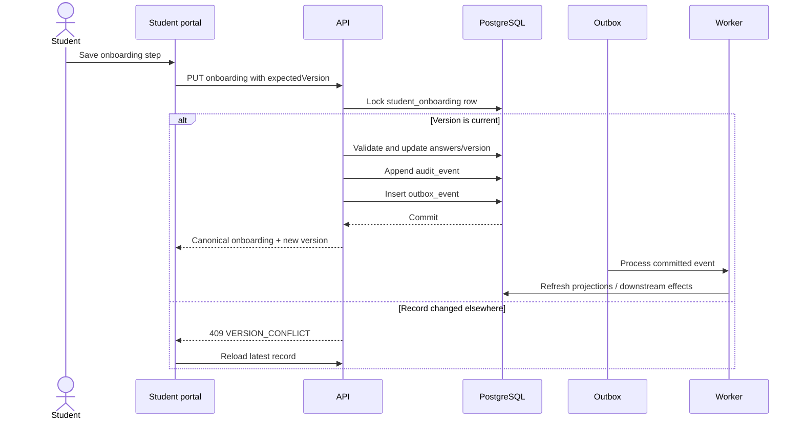
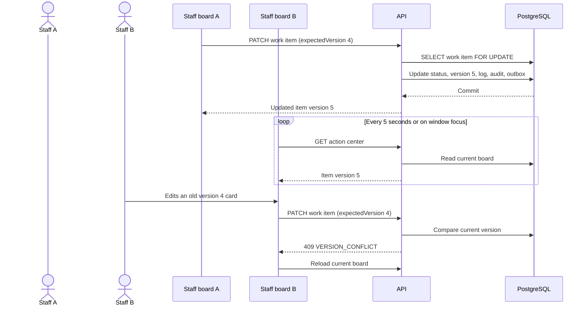
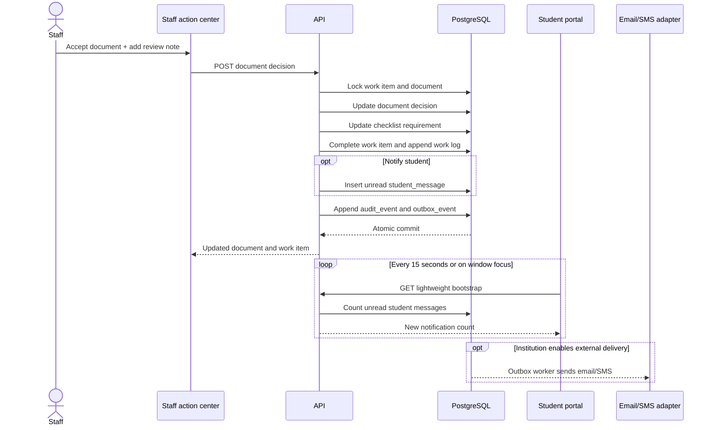

# Staff Action Center and Shared State

## Product boundary

The staff workspace now separates team coordination from individual,
AI-prioritized work:

- A shared Jira-like task board with drag-and-drop To do, In progress, and Done
- A personal Action Center showing the signed-in staff member's 30 highest
  priority students, why each student was flagged, recommended action,
  expected impact, communication history, and journey progress
- Components as university teams
- Enrollment, document-review, and communication work-item types
- Assignee, priority, due date, escalation flag, and append-only work history
- A 400-student deterministic synthetic cohort for local load and workflow tests
- Official document decisions that update the student checklist
- Optional student inbox notifications for material staff changes
- A student inquiry portal with assignment, status, reply, and inbox delivery
- Editable tenant knowledge cards and operational Core Plays
- Structured editors for onboarding, enrollment checklists, Campus Life events,
  and the academic catalog, backed by versioned YAML that is hidden from staff
- Edward-assisted natural-language configuration drafts with explicit staff
  review and publish confirmation
- Editable Campus Life clubs shared with the student portal
- Simulation-only delegated outreach and a preview-only general Edward planner

Financial records are intentionally not a general content editor: tuition,
payments, aid, and balances are governed transactional records. They should
change through their financial-system workflows, not by editing portal copy or
YAML. External email, SMS, and voice calls remain simulations until approved
provider adapters exist.

## Staff information architecture

| Module | Primary job | Current state |
| --- | --- | --- |
| Today | Personal priorities, new inquiries, content health, and quick entry points | Implemented |
| Action Center | Signed-in staff member's prioritized student decisions, diagnosis, next action, and history | Implemented with deterministic test intelligence |
| Task board | All-staff Jira-style work with drag/drop status, assignee, priority, escalation, and history | Implemented |
| Students | Searchable cohort, student journey, risk context, documents, preferences, and connected work | Implemented; the 400 generated identities are test-only |
| Messages | Student inquiries, ownership, status, response, and student inbox notification | Implemented |
| Journeys | Structured onboarding and enrollment task editing, including input types, dependencies, points, and selection flows | Edit, draft, validate, and publish implemented |
| Campus Life | Structured club and upcoming-event editing | Create/edit and versioned publishing implemented |
| Academics | Structured course, prerequisite, instructor, credit, and meeting-pattern editing | Edit, draft, validate, and publish implemented |
| Knowledge base | University/department guidance for internal or student audiences | Create and edit implemented |
| Core Plays | Repeatable triggers, audiences, and operational steps | Create and edit implemented |
| Edward | Cross-workspace data, plans, and natural-language configuration drafts | Configuration drafts are reviewable; general actions remain preview-only |

The former Portal Content redirect page was removed. Editable domains now have
their own purpose-built pages.

## Managed YAML model

Tenant source documents live under `config/tenants/<tenant>/`:

- `journeys.yaml` contains flows and tasks. A task declares a stable id, title,
  task type, submission type, ownership, requirement status, points,
  dependencies, due-date policy, accepted file types, and optional nested
  selection flow.
- `campus-life.yaml` contains student-visible events, timing, venue, category,
  capacity, registration URL, and publication state.
- `academics.yaml` contains courses, credits, level, prerequisites, instructor,
  schedule, term, and publication state.

Raw YAML is not shown to staff. Edward never silently changes the live
configuration. A natural-language request produces an internal configuration
draft plus a human-readable change summary and warnings. The staff member
reviews that plan, validation checks schema and referential integrity, and
Publish creates a new version.
Existing completed student tasks retain their historical version; new student
journeys use the latest published configuration.

The local adapter persists published YAML versions and projects them into the
student APIs. A production implementation should store the YAML document,
parsed canonical JSON, version, author, validation result, and publication
timestamp in tenant-scoped PostgreSQL records, then emit an outbox event after
publication.

## Implementation boundary

The production PostgreSQL slice already implements the high-risk shared
workflow core:

- `staff_member`, `staff_work_item`, and append-only `staff_work_log`
- server-side tenant and staff identity checks
- row locks and expected-version conflict protection
- atomic student document/checklist/work-item updates
- audit and transactional outbox events

The expanded managed-YAML workspace, credential sign-in, and 400-student
cohort currently run in the local durable JSON adapter so product behavior can
be tested without pretending that generated people are institutional records.
Before institutional deployment:

1. Move configuration versions and personal-priority projections to
   tenant-scoped PostgreSQL tables.
2. Replace the local credential adapter with university OIDC/SAML and
   role/component mapping.
3. Import real students from the SIS/CRM; never generate the test cohort in a
   production environment.
4. Connect an approved, governed risk model and retain its evidence and model
   version. The current risk explanations are deterministic fixtures.
5. Connect email/SMS/voice providers through idempotent outbox workers,
   consent checks, rate limits, and staff confirmation.

## One database record, multiple views

The student and staff applications do not copy enrollment state into separate
UI-owned records. Both read the same tenant- and student-scoped PostgreSQL
records:

- `student_onboarding` owns onboarding answers and its optimistic version.
- `student_profile` owns contact preferences and its optimistic version.
- `student_requirement` owns checklist status.
- `document_record` owns document processing and the official decision.
- `student_message` owns the student inbox notification.
- `staff_work_item` owns staff workflow state.
- `staff_work_log` is the append-only staff history.
- `audit_event` records the authorized business mutation.
- `outbox_event` records the durable event to fan out after commit.

The development preview mirrors these records in one serialized JSON state
store. That adapter is useful for local product work, including the 400-person
synthetic cohort, but it is not the production security or multi-instance
design.

## Student enrollment sequence

The page can be left or refreshed after the request commits. The server owns
the parsing job, onboarding record, and outbox work, so navigation does not
cancel those server-side operations.

## Two staff colleagues changing the same board

Yes, one colleague's change appears for another colleague. V1 uses five-second
background refresh plus focus refresh. PostgreSQL is the source of truth, and
optimistic versions prevent a stale tab from silently overwriting newer work.

For a later multi-instance live gateway, an outbox consumer can publish a
small `work-item-changed` invalidation over SSE or WebSocket. The browser
should then refetch the canonical item; the socket payload should not become
another source of truth.

## Staff document decision and student notification

The document, checklist, task, audit entry, outbox event, and optional inbox
message commit together. A failure before commit changes none of them.

## Which states need which freshness?

| State | V1 freshness | Why |
| --- | --- | --- |
| Staff task status, assignee, escalation | Immediate local update plus 5-second board refresh and focus refresh | Colleagues coordinate actively, but sub-second collaboration is unnecessary for the first slice |
| Personal Action Center priority | Recompute/refetch after mutation, every 5 seconds, and on focus | The view is a projection of canonical student and task state |
| Managed configuration publish | Immediate publisher refresh; other sessions refresh within 5 seconds | Publishing is deliberate and versioned, not collaborative text editing |
| Student unread notification count | 15-second lightweight refresh and focus refresh | A student should notice a material update without manually reloading |
| Full student onboarding/document detail | Refetch after a local mutation or when the page opens | Larger payload; it does not need continuous polling |
| Document parsing progress | Existing bounded polling on the document surface | The job is server-owned and may outlive the page |
| Email/SMS delivery | Transactional outbox and asynchronous worker | External delivery must never hold open the database transaction |
| Audit and work history | Read after board refresh | Durable history matters more than instant animation |
| Presence, typing, cursors | Not implemented | These are collaboration cosmetics, not business state |

## Upgrade path for real-time delivery

When five-second polling becomes too expensive or slow:

1. Keep every business mutation transactional in PostgreSQL.
2. Commit an outbox event in the same transaction.
3. Let one worker publish tenant-scoped invalidation events to Redis Streams,
   NATS, or another durable broker.
4. Expose SSE for one-way board/notification invalidations. Use WebSocket only
   if bidirectional live collaboration is later required.
5. Have clients refetch the affected resource and compare its version.
6. Keep polling as a low-frequency recovery path in case a live connection is
   interrupted.

This avoids dual writes, lost notifications, and one application instance
having fresher in-memory state than another.

## Security boundary

The local staff preview uses scrypt-hashed fixture credentials and an
HTTP-only, eight-hour staff session cookie. The PostgreSQL development API
accepts a development staff identity header only on `/v1/staff/*` routes.
Neither mechanism is institutional production authentication.

Before production:

- Use institutional OIDC/SAML for staff.
- Map groups to roles and tenant-scoped components.
- Authorize every student and work-item access server-side.
- Separate permissions for view, preference update, document decision,
  reassignment, bulk action, and escalation.
- Apply FERPA-aware audit retention and sensitive-field redaction.
- Never allow staff to rewrite signed consent or identity evidence through the
  operational-preference form.
