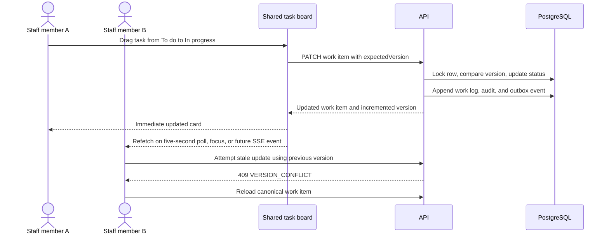
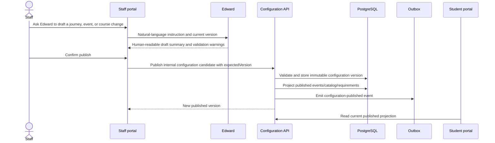

# Student–Staff User Flows and Shared Contracts

## Purpose

The student portal and staff portal are different views over the same
tenant-scoped records. The browser never owns official enrollment state; every
meaningful change is validated by the API, committed to the database, audited,
and emitted through the transactional outbox.

## Current production boundary

The PostgreSQL API already provides the durable student record, enrollment
requirements, document records, staff work items, optimistic versions,
append-only staff history, audit events, and outbox events.

The staff credential session, managed configuration workspace, personal Action
Center, generated risk explanations, and 400-student cohort currently run in
the local development adapter. They must move to tenant-scoped PostgreSQL
records and institutional authentication before a real university deployment.
Synthetic students are permitted only in local and staging environments.

## Student page flows

| Student page | Student flow | Shared contract / staff effect |
| --- | --- | --- |
| Dashboard | View progress, rewards, unread messages, and next actions. | Reads a projection of the canonical student journey and inbox. |
| My Enrollment | View requirements, open details, submit evidence, pay deposit, and follow dependencies. | `student_requirement` is the one checklist both portals use. |
| Onboarding | Complete offer review, contact details, housing and roommate choices, interests, contacts, permissions, signature, and deposit choice. | `student_onboarding` has an optimistic version; staff may update only allowed operational preferences. |
| My Documents | Upload evidence, see processing/review state, confirm eligible extraction results, retry an eligible failed extraction, and view signed records. | `document_record` is linked to the requirement and can create a staff review task. |
| My Financials | Review aid, balance, financial documents, and payment-plan choices. | Financial records are governed transactional data, not editable portal content. |
| My Classrooms | View academic plan, catalog, prerequisites, transcript-credit and exemption recommendations. | Staff publishes catalog versions; student outcomes remain governed records. |
| My Campus Life | View published events, clubs, club details, and club events. | Staff-published content becomes the student read model. |
| Messages | Read notifications from staff. | `student_message.read_at` reflects the same inbox state. |
| Help | Read support articles and submit an inquiry. | A future durable `student_inquiry` record feeds the Staff Message Portal. |
| Appointments | Create and manage eligible advisor appointments. | Appointment state is canonical student data. |
| Profile | Update permitted personal details and communication preference. | Profile version prevents a stale student or staff browser from overwriting newer data. |
| Edward | Ask student-safe questions. | Edward cannot make an official eligibility, admissions, payment, or enrollment decision. |

## Staff page flows

| Staff page | Staff flow | Canonical ownership |
| --- | --- | --- |
| Today | Review personal priorities, inquiries, and quick links. | Derived read model. |
| Action Center | Work assigned students, read risk evidence, communication history, journey progress, and recommended action. | Target: risk assessment + work items + communication events. |
| Task Board | Drag tasks between To do, In progress, and Done; assign, escalate, add notes, and view history. | `staff_work_item` and append-only `staff_work_log`. |
| Students | Inspect permitted student context, requirements, documents, and preferences. | Shared student records; field-level authorization is required. |
| Messages | Assign inquiries, reply, wait for a student, resolve, and notify the student. | Target: `student_inquiry` plus `student_message`. |
| Journeys | Edit structured onboarding/enrollment tasks or ask Edward for a reviewed draft. | Target: immutable configuration version plus student journey snapshot. |
| Campus Life | Manage clubs and publish upcoming events. | Published student-facing content projection. |
| Academics | Publish courses, prerequisites, instructors, and catalog versions. | Catalog version records; never direct transcript-outcome manipulation. |
| Knowledge Base | Maintain approved internal and student-facing guidance. | Target: versioned tenant content record. |
| Core Plays | Maintain controlled operational playbooks. | Target: versioned playbook record. |
| Edward | Draft configurations, find context, and suggest actions. | Every write requires confirmation, authorization, audit, and outbox handling. |

## Critical shared flows

### 1. Student document to staff decision

```mermaid
sequenceDiagram
    actor Student
    participant StudentUI as Student portal
    participant API
    participant DB as PostgreSQL
    participant Outbox
    participant Worker
    participant StaffUI as Staff portal

    Student->>StudentUI: Upload transcript or other requirement evidence
    StudentUI->>API: Upload with idempotency key
    API->>DB: Create document and update requirement state
    API->>Outbox: Queue extraction event in the same transaction
    API-->>StudentUI: Processing status
    StudentUI-->>Student: Navigation is safe; processing continues server-side
    Outbox->>Worker: Process committed extraction
    Worker->>DB: Store extraction result and review state
    Worker->>DB: Create or update document-review work item
    StaffUI->>API: Review document with expected work-item version
    API->>DB: Update document, requirement, task, history, and audit
    opt Notification requested
        API->>DB: Create student inbox message
    end
    API->>Outbox: Emit document-decision event
    API-->>StaffUI: Canonical decision result
    StudentUI->>API: Refresh inbox and requirement state
```

### 2. Shared task-board coordination



### 3. Staff publishing a student experience



## Cross-portal contract rules

1. A student and a staff member never maintain separate copies of the same
   enrollment checklist, document, profile, or message.
2. All mutations carry an expected version or idempotency key where replay is
   possible.
3. Staff document decisions update the document, requirement, staff work item,
   audit entry, and optional notification in one transaction.
4. New journey configuration versions apply to new journeys. A current student's
   completed tasks retain the configuration version they started with.
5. Financial balances, aid, and transcript outcomes are never generic
   YAML-editable content.
6. Real-time delivery is an optimization. PostgreSQL remains authoritative and
   every client refetches canonical data after an invalidation.

## Required production tables not yet in the PostgreSQL slice

| Table | Why it is needed |
| --- | --- |
| `managed_configuration_version` | Stores tenant YAML, validation result, publisher, status, and immutable version history. |
| `student_journey_configuration_snapshot` | Pins a student journey to the flow version that created it. |
| `student_inquiry` | Owns inbound student help requests, assignment, status, and reply lifecycle. |
| `communication_event` | Records inbound/outbound portal, email, SMS, and voice communication history. |
| `student_risk_assessment` | Stores score, evidence, model/policy version, evaluation time, and human override. |
| `staff_action_assignment` | Supports a staff member's personal Action Center without treating a score as the source of truth. |
| `knowledge_card_version` and `core_play_version` | Adds governance, approval, and history to staff-authored knowledge and playbooks. |

## Production readiness sequence

1. Port the current local staff workspace and managed-YAML state into the
   tables above.
2. Replace development headers and fixture staff credentials with OIDC/SAML,
   tenant and component role mapping, and server-side permissions.
3. Build a deterministic local/staging seed of 400 clearly synthetic students,
   diverse lifecycle states, documents, tasks, risks, messages, and conflict
   cases. Do not seed these records in a real institutional tenant.
4. Introduce provider adapters for SIS/CRM, financial aid, payment, email, SMS,
   and voice; invoke them only through the transactional outbox.
5. Add SSE invalidation for active staff boards and student notifications while
   retaining polling as recovery.
