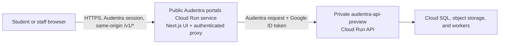

# Audentra portals Cloud Run cutover

## Status

Portal delivery is **manual-only and not yet provisioned**. Pull requests and
pushes to `main` validate the application. `.github/workflows/deploy-ref.yml`
can deploy a selected immutable ref only after the reviewed Google Cloud
resources exist; no push or merge triggers it. The authenticated streaming
portal-to-platform boundary and focused tests are implemented, but this
document does not claim a live portal deployment until provisioning, workflow
execution, and browser acceptance succeed.

The active backend is the IAM-private `audentra-api-preview` Cloud Run service
in project `audentra`, region `us-central1`. The former VM, hostname, Artifact
Registry path, deployment service account, and Workload Identity provider from
the retired personal project are historical only and must not be restored.

## Why the former deployment failed

The old post-merge job authenticated against a deleted or disabled Workload
Identity provider in the retired project before attempting to build or deploy
anything. Validation passed; deployment failed during the GitHub OIDC exchange
with `invalid_target`.

Replacing only the project ID is not a safe repair. The old workflow deploys to
a Compute Engine VM, while the current backend is private Cloud Run. A browser
cannot invoke that API with Google IAM, and the existing static Next.js rewrite
cannot mint a Google-signed ID token.

## Target boundary

The portal service is public so users can load the application. Requests to
`/v1/*` remain same-origin in the browser and are forwarded by server-side
portal code. That proxy obtains a Google-signed ID token from the portal's
runtime identity and sends it in `X-Serverless-Authorization`, with the private
API service URL as the audience. This preserves any application
`Authorization` header and keeps Google credentials out of browser code.

The proxy must preserve method, query, request body, relevant content headers,
cookies, response status, response body, and every `Set-Cookie` header. It must
not cache authenticated responses or log authorization tokens, session cookies,
uploaded files, or response bodies containing student data.

## Google Cloud resource contract

All names below are the reviewed target contract. Record the live resource IDs
after provisioning rather than assuming the names prove existence:

| Resource | Target |
| --- | --- |
| Project and region | `audentra`, `us-central1` |
| Existing private API | `audentra-api-preview` |
| Portal Cloud Run service | `audentra-portals-preview` |
| Portal Artifact Registry repository/image | `audentra-portals/web` |
| Portal runtime identity | `audentra-portals-runtime@audentra.iam.gserviceaccount.com` |
| Portal delivery identity | `audentra-portals-cd@audentra.iam.gserviceaccount.com` |
| GitHub identity provider | A portal-specific provider restricted to `Audentra-ai/Audentra-portals` |

Do not reuse the platform runtime or delivery identities. Do not create or
upload a service-account key. GitHub Actions must exchange its OIDC token
through Workload Identity Federation, and the running portal must use its
attached user-managed service account.

## Least-privilege grants

- Grant the portal runtime identity `roles/run.invoker` on
  `audentra-api-preview` only.
- Let the portal delivery identity write only to the portal Artifact Registry
  repository, update only the portal Cloud Run service, and act as only the
  portal runtime identity.
- Restrict Workload Identity impersonation to the immutable GitHub repository
  identity for `Audentra-ai/Audentra-portals` and approved refs. Do not rely on
  a mutable repository name alone.
- Keep the platform API private. Grant public invocation only to the portal
  service, not the API.
- Preserve the existing project roles of `sait.yucekaya@vekend.com`; resource
  provisioning must not replace or downgrade that account's bindings.

Creating identities and changing IAM policies requires a deliberately
authorized IAM administrator. Project Editor alone is not sufficient for every
service-account and Workload Identity policy operation.

## Application configuration

Build the portal with:

- `NEXT_PUBLIC_API_BASE_URL` unset so browser API calls remain same-origin.
- `NEXT_PUBLIC_SITE_URL` set to the public portal URL.

Configure the running service with server-only values:

- `PLATFORM_API_ORIGIN`: the private API service URL.
- `PLATFORM_API_AUDIENCE`: the private API service URL by default, or the exact
  custom audience explicitly configured on that Cloud Run service.
- `PLATFORM_API_AUTH_MODE=google`.
- `VINEXT_TRUST_PROXY=1` so Vinext honors Cloud Run's forwarded HTTPS protocol.

These server-only values are not secrets, but they must never use the
`NEXT_PUBLIC_` prefix. Any actual secret belongs in Secret Manager and must be
mounted or injected only into the server runtime.

The worker intercepts `/v1/*` before Vinext/App Router, streams uploads and SSE,
denies browser access to `/v1/student/internal/*`, and preserves independent
`Set-Cookie` headers. `/health` is not proxied because it is the student Health
page. A hosted unauthenticated upstream requires a separate explicit opt-in and
is not used for Audentra Cloud Run.

`VINEXT_TRUST_PROXY` is safe here because Cloud Run is the trusted public edge.
Do not enable it when exposing the Node server directly to untrusted clients.

## OAuth and cookie contract

Before enabling hosted Google or Microsoft SSO, configure the selected platform
service with the public portal origin for `API_PUBLIC_URL`,
`OIDC_PUBLIC_BASE_URL`, `OIDC_PORTAL_BASE_URL`, and `WEB_ORIGIN`. Keep cookies
host-only, `Secure`, and `HttpOnly`; set `SESSION_COOKIE_SAMESITE=lax` for the
same-origin portal path.

Register the public portal callback URLs with the providers:

- `/v1/auth/sso/google/callback`
- `/v1/auth/sso/microsoft/callback`
- `/v1/auth/staff/sso/google/callback`
- `/v1/auth/staff/sso/microsoft/callback`
- `/v1/staff/mail/oauth/google/callback`
- `/v1/staff/mail/oauth/microsoft/callback`

OAuth callback queries contain credentials. `provision-portals.sh` attempts to
add a bounded `_Default` sink exclusion for these fixed callback request URLs
so the Cloud Run edge does not retain `code` or `state`; platform application
logging retains its existing callback redaction. If the operator lacks
`logging.sinks.update`, provisioning completes with an explicit SSO blocker.
Confirm the exclusion before enabling hosted SSO.

## Cutover sequence

1. Reauthenticate the intended Google account and perform a read-only inventory
   of Cloud Run, Artifact Registry, service accounts, Workload Identity pools,
   IAM bindings, and enabled APIs in `audentra`.
2. Provision the two portal identities, portal Artifact Registry repository,
   repository-restricted Workload Identity provider, and least-privilege
   bindings. Record resource names without exporting credentials.
3. The authenticated streaming `/v1/*` worker proxy and focused tests are
   implemented. Keep `/health` as the student page.
4. The manual Cloud Run workflow validates the selected source, builds without
   cloud credentials, publishes one immutable digest, deploys it, verifies the
   ready revision, and checks `/v1/tenant/bootstrap` through the portal.
5. Run real browser acceptance against the deployed URL: sign in as student and
   staff, load protected data, upload a document, review it, and verify the
   student-visible outcome. Confirm browser network traffic never calls the
   private API hostname directly and inspect sanitized portal/API/worker logs.
6. Automatic deployment remains intentionally disabled. Enable it only after a
   separately approved browser pass, IAM review, and rollback rehearsal.

## Acceptance gates

- Portal CI is green and contains no retired project, VM, hostname, identity,
  or provider reference.
- GitHub obtains short-lived credentials without a stored Google key.
- The deployed image digest matches the validated commit.
- The portal is public, the API remains private, and an unauthenticated direct
  API request is denied.
- The portal runtime can invoke only the intended API service.
- Audentra login cookies work through the same-origin proxy, including
  sign-out, expiry, and tenant isolation.
- Upload and streaming bodies stay within documented limits and do not appear
  in logs.
- Browser evidence and bounded sanitized portal, API, and worker logs prove the
  core student/staff journey.

## Rollback

Cloud Run must retain the last known-good portal revision. On failed health or
browser acceptance, route all portal traffic back to that revision and disable
the deployment job while preserving the failed revision and sanitized logs for
diagnosis. A portal rollback must not make the API public, broaden IAM, or
change the backend revision implicitly.
