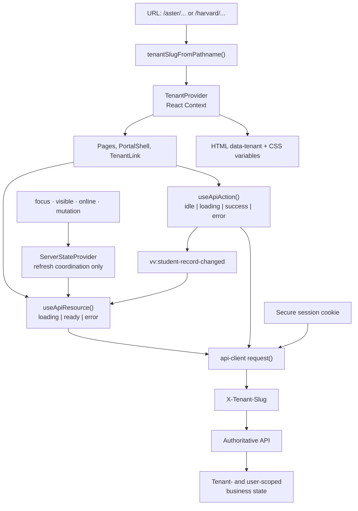
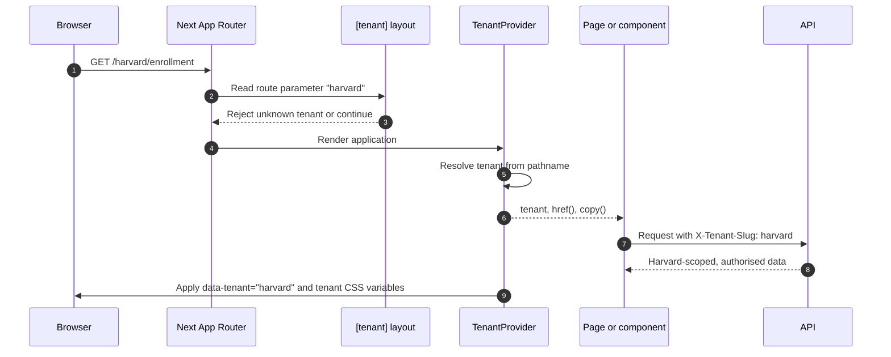
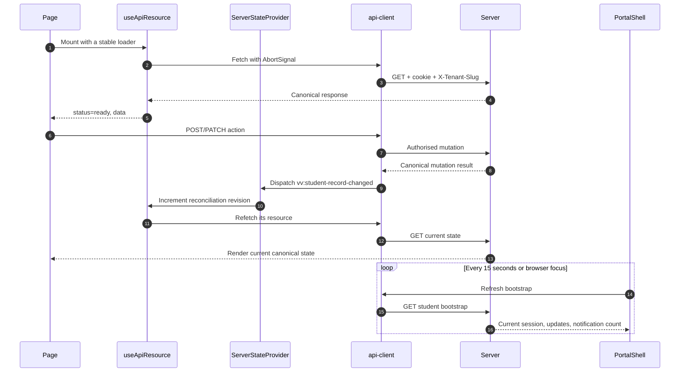
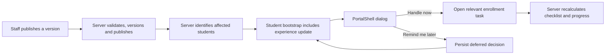

# Frontend context management

## Purpose

The portal deliberately keeps **official student and staff data out of a browser-owned global store**. React context is used for stable tenant presentation and refresh coordination, never as an authoritative record cache. Authentication, authorisation, enrolment status, checklist progress, journeys, and staff configuration remain authoritative on the API and are fetched as resources.

This separation matters in a multi-tenant education product: a stale browser tab must never be able to make a student look enrolled, show another institution's content, or overwrite a staff change with client state.

## The context model at a glance

The design has three distinct kinds of context:

| Context | Owner | Lifetime | Examples | How it is accessed |
| --- | --- | --- | --- | --- |
| Tenant presentation context | `TenantProvider` | Route lifetime | institution name, branding, route prefix, copy substitutions | `useTenant()` |
| Server reconciliation context | `ServerStateProvider` | Application lifetime | refresh revision, online state, last refresh reason | `useApiResource()` |
| Canonical business context | API/database | Request and persisted record lifetime | identity, onboarding, requirements, messages, staff configuration | endpoint-specific `useApiResource()` |
| Ephemeral UI context | Component | Component lifetime | open menu, dialog, form inputs, pending mutation state | `useState`, `useRef`, `useApiAction()` |
| Analytics session context | Browser tab | Tab session | anonymous portal session ID, page instance ID | `sessionStorage` inside `useActivityTracking()` |

## Tenant context

`apps/web/app/components/tenant-provider.tsx` owns the portal's presentation context. It derives the tenant from the first URL segment on every route change. It exposes:

- `tenant`: safe display configuration such as institution names, emails and marks;
- `href(path)`: adds the current tenant prefix and protects links from crossing tenants accidentally;
- `copy(value)`: applies the current tenant's display-name substitutions.

`TenantLink` should be used for internal links rather than `next/link` directly, and redirects should use `tenantRuntime.href(...)`. The dynamic `[tenant]` layout rejects unknown slugs before rendering a tenant route.

The URL supplies a routing hint, not security authority. The API must validate the tenant, session, and the actor's relationship to that tenant on every request. The frontend does not treat a tenant slug, local storage value, or display configuration as permission to access data.

## Server state: fetch, render, refresh

Pages load canonical data through `useApiResource` in `apps/web/app/hooks/use-api-resource.ts`. The hook owns request cancellation, the `loading | ready | error` state machine, explicit retry, stale-while-revalidate metadata, and refreshes after coordinated mutation, focus, visibility, and online signals.

A transient background-refresh error retains the last good response as `status: "ready"` with `refreshError`. A `401` or `403` is different: protected data is cleared and the resource becomes an error so route guards can sign the user out safely.

Each page owns the resource it renders. The coordinator contains signals, not records. This avoids a long-lived browser cache while still giving every mounted resource consistent recovery when a page gains focus, connectivity returns, or the server changes the student's experience.

`PortalShell` and `StudentRouteGuard` use the bootstrap response to decide whether the current student must sign in or finish onboarding. `PortalShell` also refreshes bootstrap every 15 seconds and whenever the window receives focus. That lets a staff-published change become visible without relying on a single page's stale state.

### Mutation invalidation contract

`request()` in `apps/web/app/lib/api-client.ts` dispatches `vv:student-record-changed` after successful non-GET student mutations (unless the caller explicitly opts out). `ServerStateProvider` converts that event, plus focus, visibility, and reconnect events, into a reconciliation revision observed by every `useApiResource`. This gives independent components a consistent invalidation mechanism without coupling them through a global record store.

When adding a new API mutation:

1. Return the canonical saved result from the API.
2. Use the shared `request()` path.
3. Allow the normal invalidation event, unless the mutation cannot affect student-record projections.
4. Keep any optimistic display strictly local and replace it with the server response or a refresh.

## Authentication and API request context

`apps/web/app/lib/api-client.ts` is the browser boundary for API calls. It sends `credentials: "include"`, an `Accept: application/json` header, and the current `X-Tenant-Slug`. API errors are normalised into `ApiClientError`, so resource and action hooks can show an actionable error without exposing server implementation details.

The frontend never persists credentials, roles, or official enrolment state in `localStorage`. A `401` or `403` is handled as a session/authorisation failure and sends the student to the tenant-scoped sign-in page. The server's bootstrap response, not a browser flag, decides the initial route and whether onboarding is required.

## Staff changes and student experience updates

Staff configuration is versioned and published by the backend. The browser receives a projection of the active configuration; it does not calculate which new tasks affect each student. If a published change introduces a relevant onboarding, enrollment, academic, or campus-life action, the backend includes a `StudentExperienceUpdate` in student bootstrap.

`PortalShell` presents one accessible dialog at a time. The student can handle it now or defer it; the decision is posted with the update's expected version. The next bootstrap refresh then renders the result and the relevant enrollment checklist/progress from canonical data.

This is why the frontend should not manually recompute enrolment percentages after staff edits. It should refresh and render the backend's authoritative checklist and progress projection.

## Local component state and forms

Use component state for things that are safe to discard on unmount:

- menus, tabs, dialogs, focus handling, toast/inline messages;
- a form's in-progress values and client-side validation;
- an action's pending/error state;
- a page-specific selection or expanded row.

Do not place a partially submitted form or a server record in `TenantContext`. Submit through the API, surface the returned validation error, and refresh the resource. For long, multi-step onboarding, the server stores completed steps, configuration version, and submitted answers; the client only owns the current screen's interaction state.

## Analytics context is deliberately narrow

`useActivityTracking` has one `sessionStorage` key: `aster_portal_session_id`. It is a tab-session identifier, not an authentication token. Event properties are filtered through a per-event allowlist, batched, and sent best-effort. Analytics failures are intentionally unable to block a student action.

Do not add student PII, free text, credentials, or authoritative business values to this context. Add an allowlisted, low-sensitivity property only when there is an agreed measurement need.

## Practical checklist for contributors

| If you need… | Use… | Do not use… |
| --- | --- | --- |
| Tenant name, tenant-branded link or static display copy | `useTenant()` / `TenantLink` | a manually prefixed route or hard-coded institution name |
| Current identity, unread count, onboarding gate, experience update | `getStudentBootstrap` + `useApiResource` | a global browser store or local storage |
| Page data such as enrollment, campus life, messages or profile | endpoint loader + `useApiResource` | a copy of another page's state |
| Submit a student action | API client + `useApiAction` | changing a displayed completion percentage locally |
| A temporary visual interaction | local `useState`/`useRef` | `TenantContext` |
| Analytics session correlation | `useActivityTracking` | session IDs used as authorisation |

## Key files

- `apps/web/app/components/tenant-provider.tsx` — tenant React context and document-level branding.
- `apps/web/app/components/server-state-provider.tsx` — mutation, focus, visibility, and online reconciliation signals.
- `apps/web/app/lib/tenant.ts` — tenant configuration, pathname resolution and tenant-safe link construction.
- `apps/web/app/lib/api-client.ts` — authenticated, tenant-aware API boundary and mutation invalidation.
- `apps/web/app/hooks/use-api-resource.ts` — resource/action state machines, aborts, retry and invalidation listener.
- `apps/web/app/components/portal-shell.tsx` — bootstrap refresh, route gate, student experience-update dialog and tenant-aware shell.
- `apps/web/app/components/student-route-guard.tsx` — onboarding and session protection for student pages.
- `apps/web/app/hooks/use-activity-tracking.ts` — isolated, privacy-aware tab session and best-effort event buffering.

## Current constraints and future direction

There is no shared record cache, cross-tab synchronisation, or websocket subscription in the frontend today. The coordinator, 15-second bootstrap heartbeat, and document-specific polling are deliberately conservative and easy to reason about. If the product later needs immediate high-volume updates, introduce a query layer or server-sent events behind the same ownership rules: contexts contain presentation or signals, and the server remains authoritative for every business decision.

For the dated audit, failure analysis, diagrams, and verification checklist, see `frontend-state-management-audit-2026-08-03.md`.
