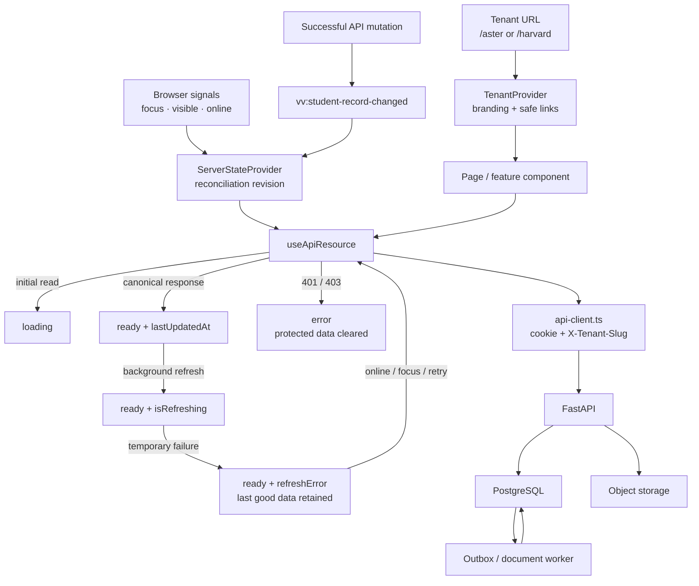
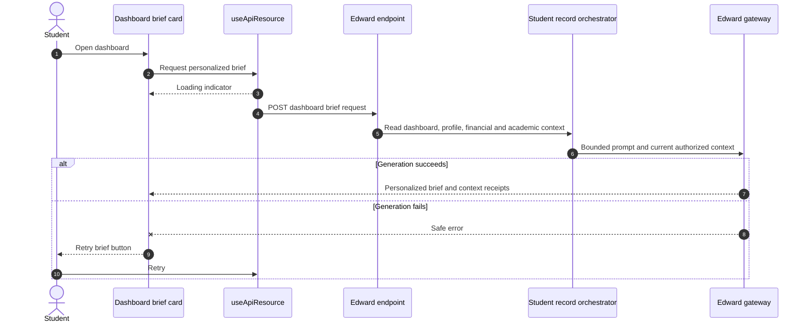

# Frontend state-management audit

**Date:** 2026-08-03
**Scope:** Aster and Harvard student portals, staff portal, uploads, background document parsing, Edward dashboard insights, and staff-to-student invalidation.

## Outcome

The portal keeps authoritative business state on the API and uses React component state only for temporary UI concerns. That ownership model is sound, but the previous refresh behavior had a reliability gap: a failed background refresh discarded the last good response. On a document page, that also removed the `processing` state which owned the polling loop. The server-side parser continued and committed its result, but the mounted page stopped asking for it. A full browser refresh created a new resource and exposed the completed result.

The repaired implementation now:

- retains the last good response during background refreshes;
- treats a refresh failure as recoverable metadata instead of replacing usable data;
- continues slow document reconciliation until the server reports a terminal state;
- prefers a terminal extraction for the same document over an older in-memory
  `processing` projection, even when provider/test timestamps are non-monotonic;
- refreshes resources after successful mutations, connection restoration, focus, and tab visibility;
- immediately discards stale data on `401` or `403` so reliability never weakens authorization;
- gives processing documents a visible connection warning and a manual **Check now** control;
- generates Edward's dashboard brief through the Edward API, with loading, retry, and interrupted-refresh states.

## Audited state inventory

The audit covered 31 `useApiResource` consumers across bootstrap and route guards; dashboard; enrollment and requirement detail; onboarding; profile; messages; payments; financials; academics; Campus Life and clubs; appointments; help; documents; staff workspace and action center; and the Edward dashboard brief.

It also covered mutation invalidation in `api-client.ts`, the upload component's per-file state, the requirement page's server-record polling, Portal Shell's bootstrap interval, and tenant presentation context.

## State ownership model

| State class | Canonical owner | Browser owner | Recovery rule |
| --- | --- | --- | --- |
| Enrollment, progress, requirements, document/extraction status | FastAPI + PostgreSQL | Last fetched projection | Refetch; never derive completion locally |
| Staff journey and content versions | FastAPI + PostgreSQL | Current editor draft | Publish with expected version, then invalidate |
| Tenant branding and tenant-safe links | URL + static tenant config | `TenantProvider` | Re-resolve on pathname change |
| Refresh/focus/online signals | Browser runtime | `ServerStateProvider` | Increment reconciliation revision |
| Form values, open dialogs, drag state, selected files | Current component | Local `useState`/`useRef` | Safe to discard on unmount |
| Uploaded original and parser job | Object storage + DB + worker | Status projection only | Reopen or refocus and read the server record |
| Edward brief | Edward API using current record context | Current generated response | Loading, retry, and background refresh |
| Authentication and authorization | Secure cookie + API policy | No browser-owned role state | Clear protected data on `401`/`403` |

## Current architecture diagram



The reusable source for this diagram is stored in `frontend-server-state-lifecycle.mmd`.

## Transcript upload and recovery sequence

```mermaid
sequenceDiagram
  autonumber
  actor Student
  participant UI as Requirement page
  participant Upload as DocumentUpload
  participant State as useApiResource
  participant API as FastAPI
  participant Files as Object storage
  participant DB as PostgreSQL
  participant Worker as Parser worker
  participant Coord as ServerStateProvider

  Student->>Upload: Select transcript and upload
  Upload->>API: POST document with idempotency key
  API->>Files: Store original
  API->>DB: Commit document and parsing event
  API-->>Upload: documentId and processing status
  Upload-->>UI: Original stored; parsing

  Worker->>DB: Claim committed parsing event
  Worker->>Files: Read original
  Worker->>DB: Save extraction result

  loop While server status is processing
    State->>API: GET student documents
    alt Response succeeds
      API-->>State: Latest canonical document
      State-->>UI: Keep or replace projection
    else Connection temporarily fails
      API--xState: Network failure
      State-->>UI: Keep last good processing state and warning
    end
  end

  Note over Student,Coord: Student may navigate away, background the tab, or lose connectivity
  Student->>Coord: Return, focus tab, or reconnect
  Coord->>State: Increment reconciliation revision
  State->>API: GET current documents
  API-->>UI: Completed extraction without re-upload
```

## Edward dashboard brief sequence



When an external model key is configured, the Edward gateway uses the published prompt/runtime configuration. Without a model key, its bounded guided provider still produces a record-aware response; the frontend does not substitute a hard-coded sentence.

## Findings and remediations

| Severity | Finding | Risk | Remediation |
| --- | --- | --- | --- |
| High | Refresh error replaced good data with `data: null` | Document polling could stop until manual refresh | Stale-while-revalidate and `refreshError` metadata |
| High | Polling ended at the expected parser deadline | Slow but healthy jobs could appear frozen | Continue at a 15-second backoff until terminal state or unmount |
| High | A retry's optimistic `processing` projection could outrank the later terminal server record by timestamp | A failed parse stayed visually stuck until refresh | For the same document ID, terminal server status has precedence over `processing`; the retry control reappears automatically |
| High | Retaining stale data could be unsafe for expired sessions | Protected view might remain after authorization loss | `401`/`403` always clear data and enter terminal error |
| Medium | Focus and reconnect behavior lived in individual components | Inconsistent recovery across pages | Central `ServerStateProvider` signals every mounted resource |
| Medium | Portal Shell had a second focus listener | Duplicate bootstrap requests | Focus ownership moved to the coordinator; 15-second heartbeat remains |
| Medium | Edward's dashboard quote was hard-coded | Brief could contradict current student state | Agent request with loading, failure, retry, and refresh states |
| Medium | Invalid selections could exist in older journey versions | Student saw an impossible response form | Frontend and backend publish validation; legacy-safe student fallback |

## Resource state machine

```mermaid
stateDiagram-v2
  [*] --> Loading
  Loading --> Ready: initial request succeeds
  Loading --> Error: initial request fails
  Error --> Loading: Retry
  Ready --> Refreshing: mutation / poll / focus / online / visible
  Refreshing --> Ready: newer canonical response
  Refreshing --> ReadyWithWarning: temporary failure; retain data
  ReadyWithWarning --> Refreshing: automatic or manual retry
  Refreshing --> Error: 401 or 403; clear data
```



`ReadyWithWarning` is represented as `status: "ready"` plus `refreshError`, so existing pages continue rendering their canonical snapshot while recovery UI can be presented where appropriate.

## Contributor rules

1. Keep official student and staff state on the server; do not mirror it in `localStorage` or tenant context.
2. Use `useApiResource` for canonical reads and `useApiAction` for mutations.
3. Mutations must return a canonical result and normally allow `request()` to dispatch `vv:student-record-changed`.
4. Render the returned result immediately when useful, then reconcile from the server.
5. A background refresh must not blank an already usable screen on a transient network error.
6. Authentication failures are not transient refresh errors; clear protected data.
7. Long-running jobs must be identified by a persisted server record, not a component-owned promise.
8. Poll only while the server says the job is non-terminal, back off, and resume on focus or reconnect.
9. Use idempotency keys for retries of create and submit actions.
10. Never calculate enrollment completion or staff-change impact in the browser.

## Verification checklist

- Upload a transcript, navigate away while processing, return, and confirm the same document ID completes.
- Force a retryable parser failure; confirm `processing` changes to **Retry parsing** without a browser refresh.
- Interrupt the documents GET request once; confirm the last good status remains and polling retries.
- Background and restore the tab; confirm an immediate canonical refresh.
- Switch the browser offline and online; confirm the visible connection warning clears after recovery.
- Expire the session; confirm a subsequent `401` clears protected content and routes to sign-in.
- Open the dashboard; confirm Edward shows loading before a generated brief.
- Fail the Edward request; confirm **Retry brief** starts a new request.
- Publish a single/multiple selection with zero or one option; confirm both UI and API reject it.

## Deliberate constraints

The frontend still does not use a normalized query cache, websocket, service worker, or cross-tab `BroadcastChannel`. Those are not required to fix this incident. If real-time volume later justifies SSE/websockets or a query library, it should sit behind the same rules: server authority, tenant isolation, authorization-first failure handling, idempotent mutations, and resumable server jobs.
