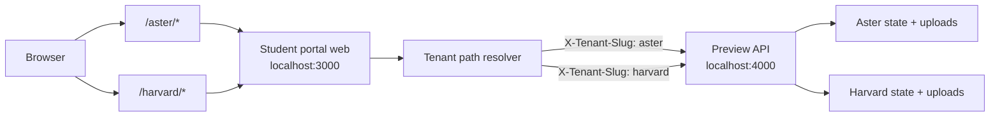
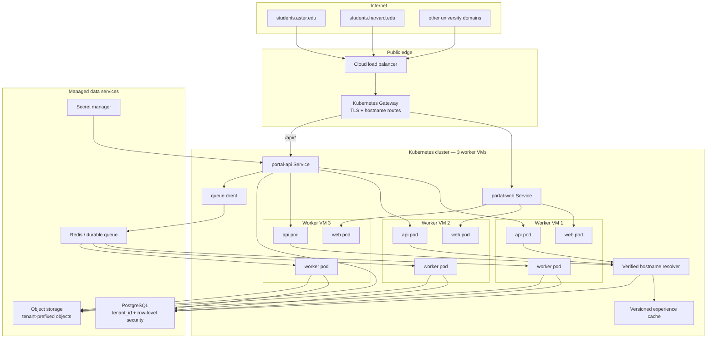

# Multi-tenant student portal deployment

## Current VM preview

The local preview uses path-based tenant resolution so it can host multiple
university experiences without DNS or certificate setup.



Local routes:

- `http://localhost:3000/aster/onboarding`
- `http://localhost:3000/harvard/onboarding`

The web runtime preserves the tenant prefix across links and redirects. The
preview API validates the tenant slug before choosing a state store. Credential
accounts are scoped to the tenant, and the same email address may belong to
different universities without sharing student records.

The request header is a local-preview transport. It must not be trusted as the
production source of tenant identity.

## Kubernetes production target

Production resolves the tenant from a verified hostname at the edge/API
boundary. All universities share stateless application deployments, while
configuration, student records, prompts, assets, rate limits, and audit trails
remain tenant-scoped.



## Request and isolation rules

1. DNS and TLS identify the requested university domain.
2. The API resolves that hostname through `tenant_domain`.
3. Authentication must belong to the resolved tenant.
4. Every database operation includes the resolved `tenant_id`.
5. PostgreSQL row-level security provides a second isolation boundary.
6. Object keys start with `tenants/{tenant_id}/`.
7. Experience and prompt caches include tenant and published version.
8. Queue jobs include tenant, student, operation, and configuration version.
9. Rate limits and AI concurrency are enforced per tenant.
10. Logs and audit events record the resolved tenant without recording secrets.

## Workload placement

Start with three web replicas and three API replicas, spread one per VM with
`topologySpreadConstraints`. Run two or three worker replicas and scale them
from queue depth. Use PodDisruptionBudgets, resource requests/limits, readiness
probes, NetworkPolicies, and HorizontalPodAutoscalers.

The number of tenants does not determine the pod count. Aggregate concurrent
traffic, document-processing volume, and AI queue depth determine capacity.

## Migration from local paths to production domains

The UI and API operate on a normalized tenant context. Only the resolver
changes:

```text
Local preview: first URL segment -> tenant slug
Production:    verified Host header -> tenant_domain -> tenant id
```

Path-prefixed URLs can remain available for development, but production routes
should use university domains so cookies, branding, analytics, and security
policies have a natural tenant boundary.
