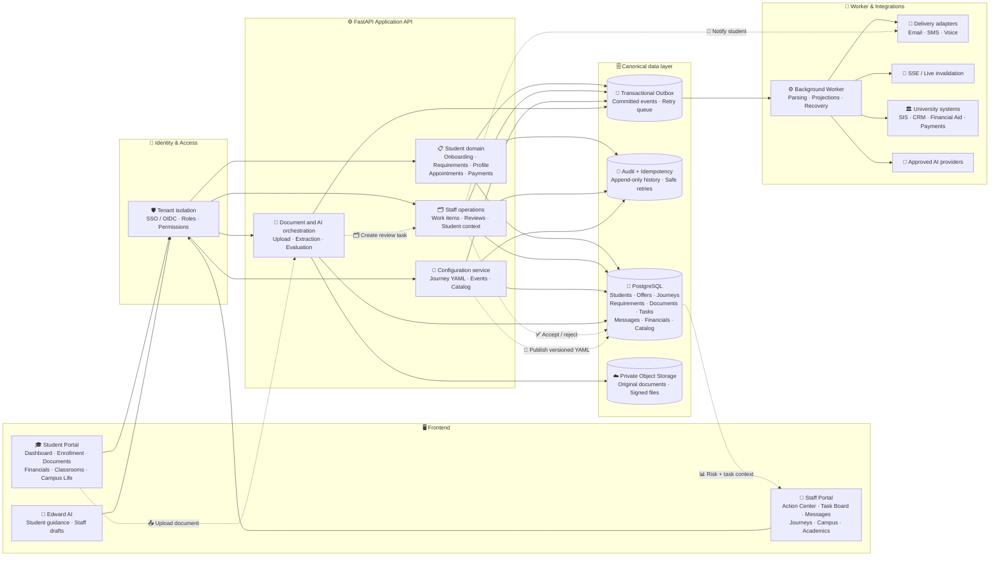

# Student–Staff System Diagram for diagrams.net

In diagrams.net (draw.io), select **Insert → Advanced → Mermaid** and paste
the source below.

```mermaid
flowchart LR
  subgraph FE["🖥️ Frontend"]
    Student["🎓 Student Portal<br/>Dashboard · Enrollment · Documents<br/>Financials · Classrooms · Campus Life"]
    Staff["💼 Staff Portal<br/>Action Center · Task Board · Messages<br/>Journeys · Campus · Academics"]
    Edward["🤖 Edward AI<br/>Student guidance · Staff drafts"]
  end

  subgraph Identity["🔐 Identity & Access"]
    Auth["🛡️ Tenant isolation<br/>SSO / OIDC · Roles · Permissions"]
  end

  subgraph BE["⚙️ FastAPI Application API"]
    StudentAPI["📋 Student domain<br/>Onboarding · Requirements · Profile<br/>Appointments · Payments"]
    StaffAPI["🗂️ Staff operations<br/>Work items · Reviews · Student context"]
    ConfigAPI["🧩 Configuration service<br/>Journey YAML · Events · Catalog"]
    DocAPI["🔎 Document and AI orchestration<br/>Upload · Extraction · Evaluation"]
  end

  subgraph Data["🗄️ Canonical data layer"]
    PG[("🐘 PostgreSQL<br/>Students · Offers · Journeys<br/>Requirements · Documents · Tasks<br/>Messages · Financials · Catalog")]
    Audit[("📜 Audit + Idempotency<br/>Append-only history · Safe retries")]
    Outbox[("📮 Transactional Outbox<br/>Committed events · Retry queue")]
    Storage[("☁️ Private Object Storage<br/>Original documents · Signed files")]
  end

  subgraph Async["🚀 Worker & Integrations"]
    Worker["⚙️ Background Worker<br/>Parsing · Projections · Recovery"]
    Notify["📨 Delivery adapters<br/>Email · SMS · Voice"]
    Realtime["📡 SSE / Live invalidation"]
    University["🏛️ University systems<br/>SIS · CRM · Financial Aid · Payments"]
    AI["🧠 Approved AI providers"]
  end

  Student --> Auth
  Staff --> Auth
  Edward --> Auth

  Auth --> StudentAPI
  Auth --> StaffAPI
  Auth --> ConfigAPI
  Auth --> DocAPI

  StudentAPI --> PG
  StaffAPI --> PG
  ConfigAPI --> PG
  DocAPI --> PG
  DocAPI --> Storage

  StudentAPI --> Audit
  StaffAPI --> Audit
  ConfigAPI --> Audit

  StudentAPI --> Outbox
  StaffAPI --> Outbox
  ConfigAPI --> Outbox
  DocAPI --> Outbox

  Outbox --> Worker
  Worker --> Notify
  Worker --> Realtime
  Worker --> University
  Worker --> AI

  Student -. "📤 Upload document" .-> DocAPI
  DocAPI -. "🗂️ Create review task" .-> StaffAPI
  StaffAPI -. "✅ Accept / reject" .-> PG
  StaffAPI -. "🔔 Notify student" .-> Notify
  ConfigAPI -. "🧾 Publish versioned YAML" .-> PG
  PG -. "📊 Risk + task context" .-> Staff
```
